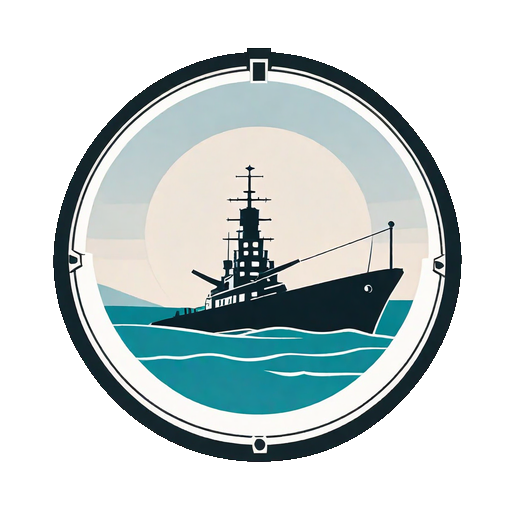

# Schulprojekt: Schiffe-versenken
<h3 align="center"></h3>

## Ziel

Ziel des Projektes ist das Erstellen eines Schiffe-versenken Spiels.
Es werden Scripte für den Client und dem Server erstellt. 
Das Projekt beinhaltet
- User-Authentifizierung
- Datenbanken zur Speicherung von gespeicherten Spielen, Spielerstatistiken, Userdaten
- Objektorientiertes Programmieren der Spiellogik.

## Beteiligte

### Lehrer

- Signitzer Markus

### GUI

- Tobias Ortner: Spielfeld und Ton
- Jonas Moretti: Login und Spielauswahl

### Userdaten und Spielspeicherung

- Mohammad Ali Taha: Speichern der gespeicherten Spiele in einer Datenbank
                     User-Authentifizierung
                     Statistiken speichern

### Spiellogik

- Luis Neuner: Erstellen der Kernspiellogik

### Netzwerkverbindung

- Robert Schmid: Kommunikation zwischen Clients und dem Server

### Scrum Master und Hilfe bei Problemen

- Lukas Malleier

Logo made with [Hotpot.ai](hotpot.ai/art-generator)
